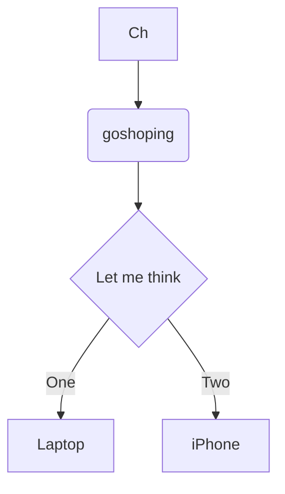

# 标题

```
   # 一级标题
   ## 二级标题
   ### 三级标题
   #### 四级标题
   ##### 五级标题
   ###### 六级标题
   
```

# 字体

``` 
斜体
*斜体*

加粗
**加粗**

斜体加粗
***斜体加粗***

删除线
~~删除线~~
```

# 列表

``` 
有序列表
1. 有序一
2. 有序二
3. 有序三

无序列表 * - + 都可以
* 无序一  
* 无序二  
* 无序三  
```
# 图片与链接
```

[显示名](链接)


```


[链接实例](www.baidu.com)
# 代码块 
```
多行代码
        ```
        内容
        ```
单行代码`create table tb1`
```
# 流程图 GIT不支持

```flow
st=>start: start
op=>operation: My Operation
cond=>condition: Yes or No?
e=>end
st->op->cond
cond(yes)->e
cond(no)->op
```



效果预览 


- [x] 代办事项
  - [x] 第二
    - [X] 第三
- [ ] 第四

使<b>用</b> <kbd>Ctrl</kbd>+<kbd>Alt</kbd>+<kbd>Del</kbd> 重启<em>电脑</em>
