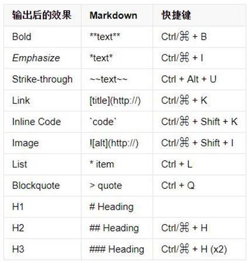
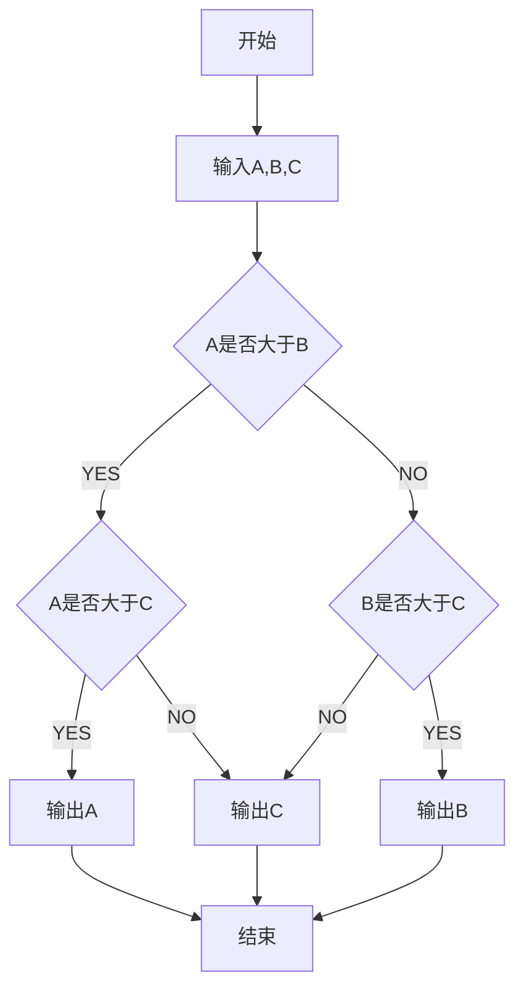
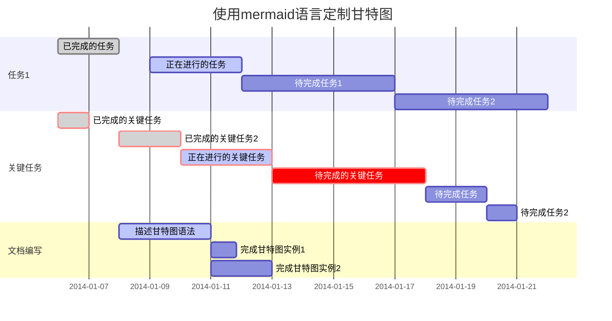
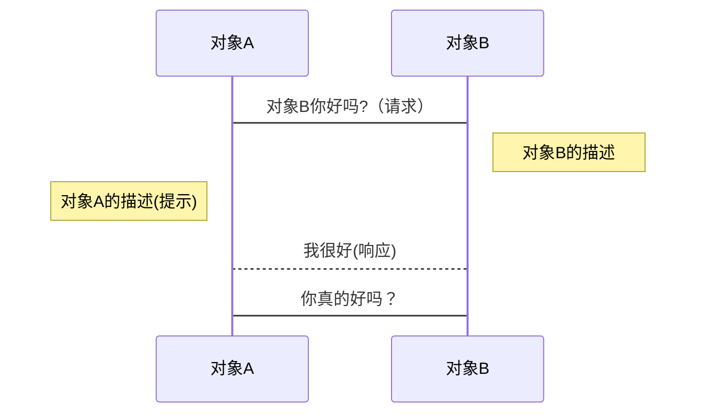
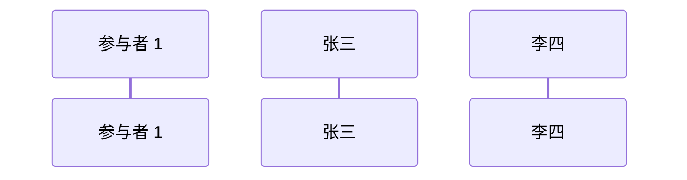

[TOC]

# 用Typora写的Markdown教程

## Markdown 介绍
Markdown 是一种轻量级标记语言，它允许人们使用易读易写的纯文本格式编写文档，然后转换成格式丰富的 HTML 页面。
下常用语法图，以及在一些编辑器上的快捷键  



## 工具支持
目前支持 Markdown 语法的工具和产品很多，下面列举一些常见的

支持网站

- GitHub

- StackOverflow

- CSDN

- OpenStreetMap

- 博客园

- 简书

- 知乎

- 掘金

- 有道云笔记  

编辑器
  - Windows 平台
    - Typora
    - MarkdownPad
    - MarkPad
    - VS Code
  - Linux 平台
    - ReText
    - Haroopad
    - VS Code
  - Mac 平台
    - Bear
    - Mou
    - MacDown


>关于Markdown版本演变可参考 [参考链接](https://www.cnblogs.com/lijinfeng042/p/9678684.html#markdown-%E7%89%B9%E6%80%A7)


# 字体
``` 
*斜体*     

**粗体**    

***粗斜体***   

~~删除线~~   

~~***粗斜体***~~
```
>可以嵌套-最近的成对标签 同HTML

*斜体*     

**粗体**    

***粗斜体***   

~~删除线~~    

~~***删除粗斜体***~~

# 标题
```
#后加标题内容，一级用一个，二级用两个，以此类推，最高支持六级标题 同Html 
   # 一级标题
   ## 二级标题
   ### 三级标题
   #### 四级标题
   ##### 五级标题
   ###### 六级标题
```
>注： #字符后要空一格输入标题
# 一级标题
## 二级标题
### 三级标题
#### 四级标题
##### 五级标题
###### 六级标题

---

# 代码块
```
可添加代码，或者可以说在三个`字符中的内容 不会被markdown标记渲染，包括空格

`单行代码`
(```)
  多行代码...
  多行代码...
  多行代码...
(```)
注：为了防止转译，前后三个反引号处加了小括号，实际是没有的。这里只是用来演示，实际中去掉两边小括号即可。
```

`单行代码`

```
  多行代码...
  多行代码...
  多行代码...
```
>Markdown中以两个空格为换行，部分回车即换行，取决于不同的渲染引擎，
>三种渲染引擎
>Hoedow 
>Marked
>Markdown-it

---
# 图片和链接

```
图片:
 
[链接文本](链接地址) 或者 直接使用<链接地址>

图片与文本链接差别在于图片链接语句前有个 ! 
Markdown无法指定图片高度和宽度 

范例：
      [百度](https://www.baidu.com)
      <https://www.baidu.com>
```


[百度](https://www.baidu.com)

<https://www.baidu.com>

>注：MD里的链接以及生成的html链接都是直接跳转，要在新窗口打开还是要设置Html里的a标签target属性 \_blank

# 表格

```
语法格式


| 例子           |        表头1 |     表头2 |       表头3       |
| --------------| -----------: | :--------: | :------------- |
| 默认内容左对齐 | 内容  右对齐 | 内容 居中 | 内容四 左对齐实例 |


| 例子        |          表头1 | 表头2 |    表头3  |
| - | :---- | :-: | -:|
| 默认内容左对齐 | 内容  右对齐 | 内容 居中  |   内容四 右对齐实例 |
|  ***支持粗斜体***    |  ~~支持删除线~~     | 支持链接 [转义字符](https://blog.csdn.net/MakerCloud/article/details/82082632)     | 支持图片     |
|  |  |  |  |
```

| 例子        |          表头1 | 表头2 |    表头3  |
| - | ----- | :-: | -:|
| 内容kkkkkkkkkk | 内容kkkkkkkkkk | 内容kkkkkkkk |      内容四 右对齐实例 |
|  ***支持粗斜体***    |  ~~支持删除线~~     | 支持链接 [转义字符](https://blog.csdn.net/MakerCloud/article/details/82082632)     | 支持图片     |
|||||


# 引用
```
>后加文字  可嵌套  可以一直加>一直嵌  不过没什么用

范
> 引用1
>> 引用2
>>>>>>>> 引用3

> ***粗斜体***
> [转义字符](https://blog.csdn.net/MakerCloud/article/details/82082632)
> 

```
> 引用1
> > 引用2
> >
> > >>>>>> 引用3

> 引用   
> ***粗斜体***
> [转义字符](https://blog.csdn.net/MakerCloud/article/details/82082632)
> 

# 分割线
```
三个或三个以上* 或-字符
***
---
```
***
---

# 列表
```
在-减号 +加号 *星号 后加一个空格再加字符 嵌套换行空两格

- 1无序
  - 2 无序嵌套
    - 3 无序嵌套2
- 1无序
+ 2
+ 2
* 3
* 3

1. 有序
   - 有序嵌套
     - 有序嵌套2 
2. 有序
3. 有序
```
- 1无序
  - 2 无序嵌套
    - 3 无序嵌套2
- 1无序
+ 2
+ 2
* 3
* 3

1. 有序
   - 有序嵌套
     - 有序嵌套2 
2. 有序
3. 有序


# 常用转义字符 

```
在字符前加转义符\即可
\\ 反斜杠

\` 反引号

\* 星号

\_ 下划线

\{\} 大括号

\[\] 中括号

\(\) 小括号

\# 井号

\+ 加号

\- 减号

\. 英文句号

\! 感叹号

在转换成Html文件后，与字符（&）是一个特殊字符，需要用到的时候，要使用它的实体转义。如果你要打「AT&T」 ，你必须要写成「AT&amp;T」。而网址中的 & 字符也要转换。比如你要链接到：

http://images.google.com/images?num=30&q=larry+bird

你必须要把网址转换写为：

http://images.google.com/images?num=30&amp;q=larry+bird

才能放到链接标签的 href 属性里。不用说也知道这很容易忽略，这也可能是 HTML 标准检验所检查到的错误中，数量最多的。
```
[12](http://images.google.com/images?num=30&q=larry+bird)

# 待办事项
```
语法  对应html input标签 type="checkbox"  默认选中在括号里填大小写x字母都可  嵌套换行空两格 - [ ] 左右两边各要空一格	
- [x] 代办事项
  - [x] 第二
    - [X] 第三
  - [ ] 第四
```
- [x] 代办事项
  - [x] 第二
    - [X] 第三
- [ ] 第四


# 支持的Html元素

```
不在 Markdown 涵盖范围之内的标签，都可以直接在文档里面用 HTML 撰写。
如 <kbd> <b> <i> <em> <sup> <sub> <br>等

使<b>用</b> <kbd>Ctrl</kbd>+<kbd>Alt</kbd>+<kbd>Del</kbd> 重启<em>电脑</em>
```
使<b>用</b> <kbd>Ctrl</kbd>+<kbd>Alt</kbd>+<kbd>Del</kbd> 重启<em>电脑</em>

>>注：以上是常用Markdown文档及编辑器支持的语法，以下是扩展，扩展的内容依据编辑环境而定，仅部分支持，以下内容在Github，VScode，Sublimetext皆不支持，在CSDN，Typora以及有道云笔记支持。取决于网站的渲染引擎是否包含Mermaid的库


# UML图表和数学公式

部分引擎支持流程图和数学公式。当你需要在编辑器中插入数学公式时，可以使用两个美元符 $$ 包裹 TeX 或 LaTeX 格式的数学公式来实现。提交后，问答和文章页会根据需要加载 Mathjax 对数学公式或Mermaid对流程图进行渲染

关于 **LaTeX** 数学表达式，参考[链接](http://meta.math.stackexchange.com/questions/5020/mathjax-basic-tutorial-and-quick-reference)

## 公式
```
$$
\Gamma(z) = \int_0^\infty t^{z-1}e^{-t}dt\,.
$$
```
$$
\Gamma(z) = \int_0^\infty t^{z-1}e^{-t}dt\,.
$$

## 标准流程图
```
去掉`两边的（）
(```flow)
st=>start: start
ip=>inputoutput:input
op=>operation: My Operation
cond=>condition: Yes or No?
e=>end
st->op->cond
cond(yes)->e
cond(no)->op
(```)

id=>类型:框内文本 (start开始框 operation处理框 condition条件框 end结束框)
cond(条件分支)
->指向
```

```flow
st=>start: start
ip=>inputoutput: input
op=>operation: My Operation
cond=>condition: Yes or No?
e=>end
st->ip->op->cond
cond(yes)->e
cond(no)->op
```

## 基于Mermaid的流程图、时序图、甘特图
Mermaid 是一个用于画流程图、时序图、甘特图的库，使用 JS 进行本地渲染，广泛集成于许多 Markdown 编辑器中。
关于 **Mermaid** 详细语法，参考 [链接](https://mermaidjs.github.io/)

```
去掉`两边的（）
(```mermaid)
graph TD
    start[开始] --> input[输入A,B,C]
    input --> conditionA{A是否大于B}
    conditionA -- YES --> conditionC{A是否大于C}
    conditionA -- NO --> conditionB{B是否大于C}
    conditionC -- YES --> printA[输出A]
    conditionC -- NO --> printC[输出C]
    conditionB -- YES --> printB[输出B]
    conditionB -- NO --> printC[输出C]
    printA --> stop[结束]
    printC --> stop
    printB --> stop
(```)
列举部分语法：
流程图开始的 graph TD
TB=TD 从上到下
BT    从下到上
RL    从右到左
LR    从左到右
基本图形
id[方框] id(圆角矩形) id >带本文的不对称矩形] id{带文本的菱形} id((带文本的圆形))
连接
A --> B A带箭头指向B
A --- B A不带箭头指向B
A -.- B A用虚线指向B
A -.-> B A用带箭头的虚线指向B
A ==> B A用加粗的箭头指向B
A -- 描述 --- B A不带箭头指向B并在中间加上文字描述
A -- 描述 --> B A带箭头指向B并在中间加上文字描述
A -. 描述 .-> B A用带箭头的虚线指向B并在中间加上文字描述
A == 描述 ==> B A用加粗的箭头指向B并在中间加上文字描述

```




## 甘特图
```
gantt：表示图表类型为甘特图
dateFormat：指定日期格式（Y表示年，M表示月，D表示日）。YYYY-MM-DD（2019-03-14），YY-MM-DD(19-03-14)
section： 项目关键字，空一个格之后输入项目名称。
任务行： section后每一行为一个任务。第一个字符串为任务名称，之后以:开头，添加任务属性。
接下来用下面代码实例说明常见任务属性。
任务状态：
done  已完成
active正在进行
crit  关键任务
默认任务都为待完成状态
任务描述：在des1、des2位置添加任务描述，其它任务引用时直接引用des1就可以。
after: 描述任务时间关系。des3, after des2表示des3紧跟在des2之后。
任务时长有三种方式：
时间范围 如：2014-01-06,2014-01-08
指定天数 如：5d
指定开始日期+天数 如：2014-01-06，5d

范例： 去掉`两边的()
(```mermaid)
gantt         
       dateFormat  YYYY-MM-DD   
       title 使用mermaid语言定制甘特图

       section 任务1
       已完成的任务           :done,    des1, 2014-01-06,2014-01-08
       正在进行的任务               :active,  des2, 2014-01-09, 3d
       待完成任务1               :         des3, after des2, 5d
       待完成任务2              :         des4, after des3, 5d

       section 关键任务
       已完成的关键任务 :crit, done, 2014-01-06,24h
       已完成的关键任务2         :crit, done, after des1, 2d
       正在进行的关键任务             :crit, active, 3d
       待完成的关键任务        :crit, 5d
       待完成任务           :2d
       待完成任务2                      :1d

       section 文档编写
       描述甘特图语法               :active, a1, after des1, 3d
       完成甘特图实例1      :after a1  , 20h
       完成甘特图实例2    :doc1, after a1  , 48h

(```)
```



## 时序图


```
自上而下，
sequenceDiagram 表示图标类型为时序图
Note：标注 有三种形式
Note right of 对象  描述在生命线右侧
Note left of 对象   描述在生命线左侧
Note over          描述在当中
->	无箭头的实线
–->	无箭头的虚线
->>	有箭头的实线
–->>	有箭头的虚线
范例
（```mermaid）
sequenceDiagram
对象A->对象B: 对象B你好吗?（请求）
Note right of 对象B: 对象B的描述
Note left of 对象A: 对象A的描述(提示)
Note over 对象A,对象B：覆盖描述
对象B-->对象A: 我很好(响应)
对象A->对象B: 你真的好吗？
（```）
```


```
可以明显表明参与者有哪些:
sequenceDiagram
    participant 参与者 1
    participant zs as 张三
    participant ls as 李四

```



# 常见的几个问题
  Markdown的语法设计初期没有统一标准，大多数用上述的语法，也有个例不同，区别在于生成Html的标签有差异。空格，快捷键问题。

